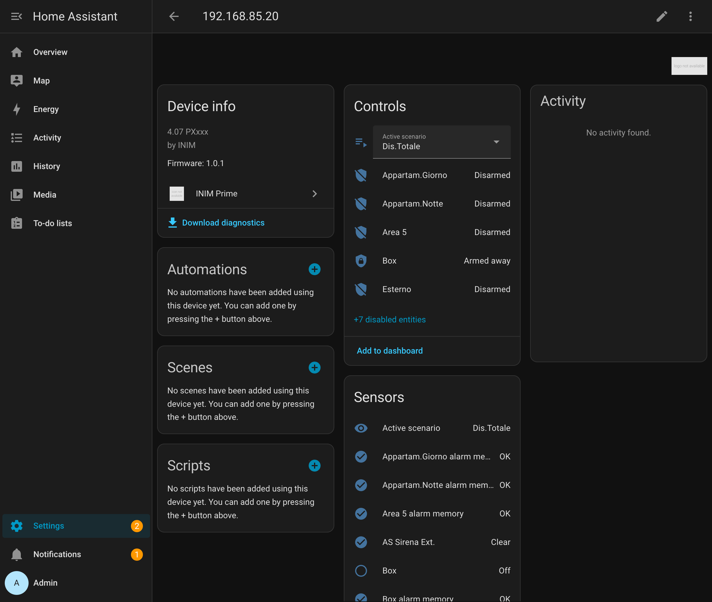
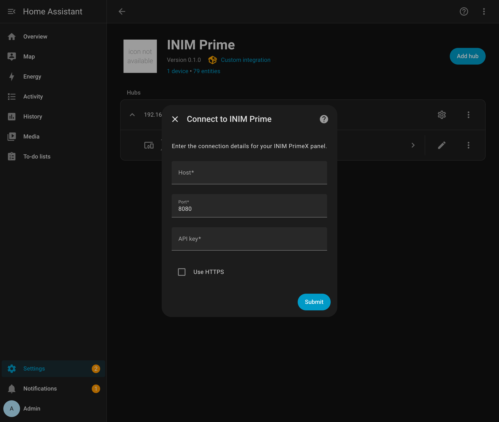
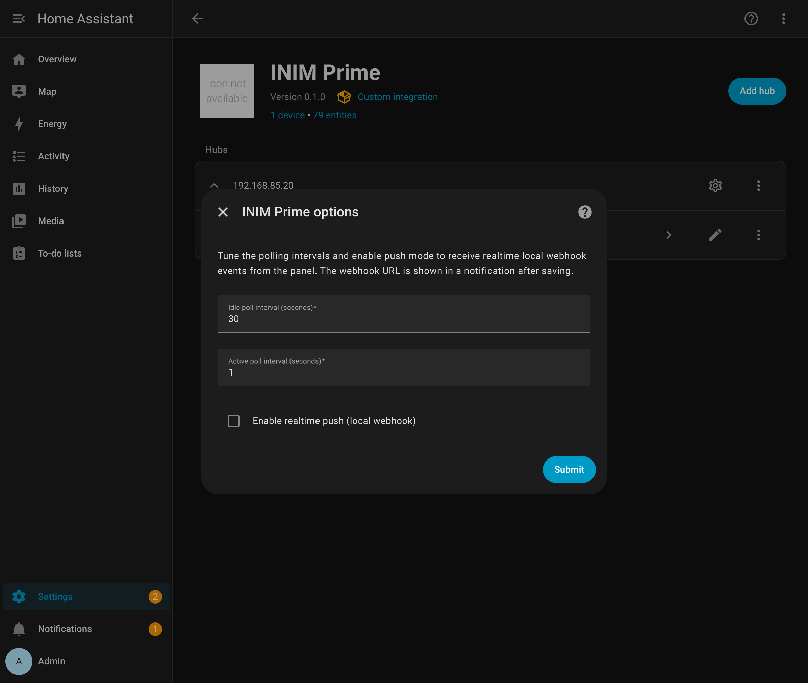

<p align="center">
  
</p>

<h1 align="center">INIM Prime — local Home Assistant integration</h1>

<p align="center">
  <a href="LICENSE"></a>
  <a href="https://github.com/thekoma/inim-prime-local/actions/workflows/validate.yml"></a>
  <a href="https://github.com/hacs/integration"></a>
  
</p>

A **local, offline-first** Home Assistant integration for **INIM Prime / PrimeX** alarm panels. It talks **only** to the panel's on-board HTTP API on your LAN (`http://<panel-ip>:8080/cgi-bin/api.cgi`) — **no cloud account, no INIM cloud, no rate limits.** Authentication is the API key you generate in the PrimeStudio software.

<p align="center">
  
</p>

## Features

| Area of the panel | Home Assistant entity | What you get |
|---|---|---|
| 🛡️ **Areas / partitions** | `alarm_control_panel` (one per area) | Arm **away / home / night**, disarm; live armed/disarmed/triggered state |
| 🎬 **Scenarios** | `select` + per-scenario `binary_sensor` *(disabled by default)* | Apply any arming scenario. *Use the area `alarm_control_panel` for the actual arm state — the panel only reports a scenario as "active" for the system-wide Total macro ([details](docs/known-limitations.md)).* |
| 🚪 **Zones** | `binary_sensor` (one per zone) | Open / closed in realtime; device class (and so the icon) guessed from the zone name in **12 languages** — window, door, garage, motion, smoke, gas, CO, water, vibration, tamper |
| 🚫 **Zone bypass** | `switch` (one per zone) | Include / exclude a zone from arming |
| ⚡ **Outputs** | `switch` (one per output) | Toggle panel outputs *(needs the panel "Code" enabled — hidden by default)* |
| 🔋 **Power & faults** | `sensor` + `binary_sensor` | Supply voltage, open-zone count, system fault + a per-fault breakdown |
| 🧹 **Alarm memory** | `button` (one per area) | Clear alarm memory; per-area alarm-memory sensors |
| 🩺 **Diagnostics** | `sensor` | API connection count, last API client, panel/firmware info |

Unused **factory-default areas** (`AREA 006…`), the **output switches**, and the **per-scenario "active" sensors** are hidden by default so your entity list stays clean — re-enable any you actually use.

## Why local?

This integration never touches the INIM cloud. The mobile app and most other integrations rely on `inimcloud.com`, which is subject to INIM's tightening rate limits and means your alarm depends on an external service. Here, Home Assistant and your panel talk directly over your LAN. See [Alternatives](#alternatives-and-prior-art) for cloud-based options if you prefer broader panel coverage.

## Installation

### HACS (recommended)
1. HACS → ⋮ → **Custom repositories** → add `https://github.com/thekoma/inim-prime-local` as an **Integration**.
2. Install **INIM Prime**, then restart Home Assistant.

### Manual
Copy `custom_components/inim_prime/` into your Home Assistant `config/custom_components/` directory and restart.

## Configuration

In PrimeStudio, open the PrimeLAN configuration, enable the HTTP API and **Generate** an API key (note the panel IP and port — usually `8080`). Then in Home Assistant: **Settings → Devices & Services → Add Integration → INIM Prime**.

<p align="center"></p>

| Field | Notes |
|---|---|
| **Name** | Friendly name for the panel (e.g. `Allarme`). Used for the device and entity names — so entities read `Allarme Finestra Camera`, **not** the panel IP. |
| **Host** | Panel IP, e.g. `192.168.1.50` |
| **Port** | `8080` (default) |
| **API key** | The key generated in PrimeStudio |
| **Use HTTPS** | Only if the PrimeLAN board has HTTPS enabled |

### Rooms & areas

By default the integration **groups each zone (and its bypass switch) under a per-room device** — *Camera*, *Taverna*, *Bagno*, *Garage*… — inferred from the zone name in your language. In the post-setup "assign areas" dialog (and later in **Settings → Areas**) you then drop each room device into the matching Home Assistant **area**, in one step per room. Zones whose name has no recognisable room stay on the main panel device. Turn this off with **Group zones by room** in *Configure* if you'd rather keep everything on one device.

**Rotating the key?** Use **⋮ → Reconfigure** on the integration to enter a new API key without removing anything.

## Settings: polling & tuning

Open **Configure** on the integration to tune how it reads the panel.

<p align="center"></p>

| Option | Default | Meaning |
|---|---|---|
| **Idle poll interval** | `30 s` | How often to refresh when nothing is happening |
| **Active poll interval** | `1 s` | Faster cadence for a short window after any change/event |
| **Enable realtime push** | off | Register a local webhook for instant updates (see below) |
| **Zone label language** | Auto | Language used to guess each zone's icon (and room) from its name (window/door/garage/motion/smoke/…). *Auto* follows Home Assistant's language; 12 languages are supported. |
| **Group zones by room** | on | Place each zone under a per-room device (Camera, Bagno, Garage…) guessed from its name, so you can assign whole rooms to HA areas. |

### How fast can it go? (measured on a real PrimeX 4.07)

- A **full refresh cycle** (areas + zones + scenarios + outputs + faults) takes **~0.5 s** — it's the network round-trips, not Home Assistant, that set the floor.
- The panel's data is **effectively live** (a state change shows up within **~0.2 s**); there is **no slow internal refresh** that would make fast polling pointless.
- The panel's cgi is single-threaded, so requests are issued **sequentially** and never concurrently.

This means polling faster than ~0.5 s/cycle gains nothing, and ~1 s active polling already gives near-realtime responsiveness. It does **not** slow Home Assistant: polling is fully async (the event loop stays free during network waits), payloads are a few KB, and the recorder only logs *actual* state changes — not every poll.

**Built-in protection so HA never suffers:** each request has a 5 s timeout, the whole cycle an 8 s hard ceiling (→ entities go *unavailable*, never hang), an overlap guard means **at most one cycle is ever in flight** (refreshes coalesce, requests never queue up), and after repeated failures it backs off to the idle interval instead of hammering an unreachable panel.

## Realtime (optional, fully local)

Polling is already snappy, but you can get **instant** updates with zero cloud:

- **Panel HTTP event-push → HA webhook** (this integration). Enable *realtime push* in the options; HA shows you a local webhook URL. In PrimeStudio's *event-action ("Invio pagine web")* table, point the events you care about at that URL (each entry encodes its zone/area/event in the URL). The panel then pushes events to HA and entities update optimistically and instantly; polling stays on as a reconciliation backstop. See [docs/realtime.md](docs/realtime.md) for the exact setup and the per-event URL scheme.
- **SIA-IP** (alternative). The panel can also report events to Home Assistant's built-in [`sia`](https://www.home-assistant.io/integrations/sia/) integration over the standard SIA-DC09 protocol — another fully-local realtime path. Documented in [docs/realtime.md](docs/realtime.md) as an alternative.

> The INIM **cloud** websocket is intentionally **not** used — depending on the cloud for a security alarm's realtime path defeats the purpose of a local integration.

## Arm-mode mapping

Home Assistant's three arm modes map to the panel like this:

| Home Assistant | Panel arming |
|---|---|
| Arm **away** | Total |
| Arm **home** | Partial |
| Arm **night** | Instant / snapshot |
| **Disarm** | Disarm |

## Forced arming (arm with open zones)

The panel refuses to arm a scenario/area while one of its zones is open ("not ready") — normal arming then raises a clear *zones not ready* error. To arm **anyway**, bypassing the open zones first (the same thing the official app's *"Forzatura inserimento"* does), use the action **`inim_prime.arm_forced`**:

```yaml
- action: inim_prime.arm_forced
  data:
    entity_id: select.inim_prime_active_scenario   # the panel; identifies the config entry
    scenario: "Ins.Notte"        # apply a scenario by name…
    # or, targeting an alarm_control_panel area instead:
    #   entity_id: alarm_control_panel.<area>
    #   mode: night              # away | home | night
    allow_partial: false         # default: refuse if a zone can't be bypassed
  response_variable: forced
# forced.bypassed_zones / forced.unbypassable_zones list what happened
```

- **Fail-closed by default**: if an open zone *cannot* be bypassed (e.g. an "unbypassable" zone), nothing is armed and the action raises, naming the zones. Set `allow_partial: true` to bypass what it can and arm anyway (it still reports what stayed open).
- **Rollback**: if the arm itself is rejected, any zone the action bypassed is automatically re-included — the panel is never left *bypassed but disarmed*.
- **Never silent**: every forced arm fires an `inim_prime_forced_arm` event (handy for logbook/automations).
- The bypassed zones stay bypassed until you un-bypass them (per-zone bypass switches) — automatic restore on disarm is planned.

> Forced arming **reduces protection** on the bypassed zones. It is an explicit action, never automatic.

## Security notes

The panel API is plaintext HTTP on your LAN and the API key is a bearer token. Treat it accordingly:

- **Keep it on the LAN.** Never port-forward `:8080` to the internet. For remote access use a VPN.
- **Use the panel's IP/MAC allow-list** (PrimeLAN settings) to accept the API only from the Home Assistant host — the single most effective control.
- **Rotate the API key** periodically (and use the *Reconfigure* flow to update it here).
- Output control requires the panel **Code**; without it the panel refuses output commands (those switches are hidden by default).

## Supported panels

| Panel | Status |
|---|---|
| INIM **PrimeX** (firmware 4.07) | ✅ Primary development hardware |
| INIM **Prime** with PrimeLAN board | ✅ Same local HTTP API — expected to work |

SmartLiving / Nexus panels use a different protocol and are **not** covered here (see Alternatives).

## Documentation

- [Configuration](docs/configuration.md) — enable the API on the panel, add & reconfigure the integration
- [Polling & tuning](docs/polling-and-tuning.md) — adaptive polling, measured limits, safety guards
- [Realtime](docs/realtime.md) — local webhook event-push and the SIA-IP alternative
- [Examples & use cases](docs/examples.md) — automations and dashboards
- [Known limitations](docs/known-limitations.md)
- [Reporting issues](docs/reporting-issues.md)

## Quality

Engineered to the Home Assistant **Platinum** quality-scale rules: fully type-annotated (`mypy --strict`, no ignores), **100% test coverage**, config + reauth + reconfigure flows, entity/exception/icon translations, diagnostics, dynamic entity lifecycle, and an injected aiohttp session with zero external runtime dependencies. Per-rule status is tracked in [`custom_components/inim_prime/quality_scale.yaml`](custom_components/inim_prime/quality_scale.yaml). *(The official Quality Scale badge applies only to core integrations; this custom integration meets the rules but is, by definition, in the "Custom" tier.)*

## Testing

This integration ships a real test suite (uncommon for this ecosystem): pure-client unit tests, Home Assistant integration tests, and a **live end-to-end** test against a real panel — all runnable via Docker:

```bash
make unit      # pure client tests
make ha-unit   # Home Assistant integration tests
make e2e       # live end-to-end (needs a reachable panel; reads .env)
```

## Alternatives and prior art

This project is local-first and specific to INIM **Prime / PrimeX** over the on-board HTTP API. If it doesn't fit your setup, these community projects are worth a look:

- **[pla10/homeassistant_inim_alarm](https://github.com/pla10/homeassistant_inim_alarm)** — the most established INIM integration. Cloud-based (INIM Cloud) with WebSocket push and an optional local SIA-IP listener; covers SmartLiving and Prime. Choose it for broad panel coverage if a cloud dependency is acceptable.
- **[Pitscheider/ha_inim_prime](https://github.com/Pitscheider/ha_inim_prime)** — a local Prime integration over the PrimeLAN Web API with rich fault/GSM diagnostics and four arm modes.
- **[matteoraf/ha-inim_smartliving_alarm_panel](https://github.com/matteoraf/ha-inim_smartliving_alarm_panel)** — fully local integration for **SmartLiving** panels over the native TCP protocol.
- **[nidble/pyinim](https://github.com/nidble/pyinim)** — a reusable async Python library for the INIM cloud API.

## Disclaimer

Community project, **not affiliated with or endorsed by INIM Electronics**. It communicates only with your own panel on your own network. Use at your own risk; an alarm system is safety-critical — verify behaviour before relying on it.
